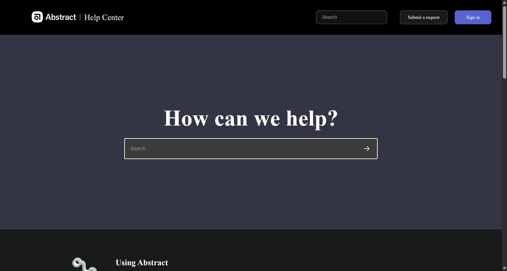

# Abstract Help Center Clone

This is a simple static clone of the **Abstract Help Center** landing page, built using only **HTML** and **CSS**.

## Preview

Screenshot of the finished page:

## Tech Stack

- HTML5
- CSS3 (no frameworks)

## Project Structure

- `index.html` – main page markup
- `style.css` – styles for the navigation bar, hero section, content grid, and footer
- `logo.svg`, `only-logo.svg`, `arrow.svg` – icons used in the UI
- `screenshot.png` – image preview of the completed layout

## Credits

This project is a practice **clone** built by following a frontend HTML & CSS project from a frontend projects website.

It is intended for learning purposes only and is not affiliated with or endorsed by Abstract or the original tutorial authors.
